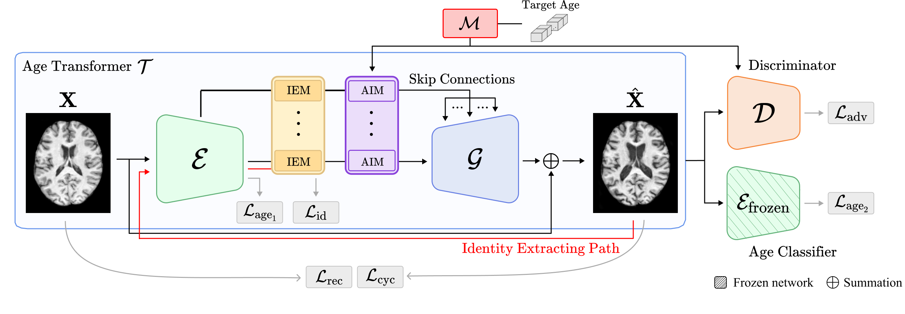

# IdenBAT: Disentangled Representation Learning for Identity-Preserved Brain Age Transformation

This code is an implementation of the paper IdenBAT: Disentangled Representation Learning for Identity-Preserved Brain Age Transformation with pytorch.
